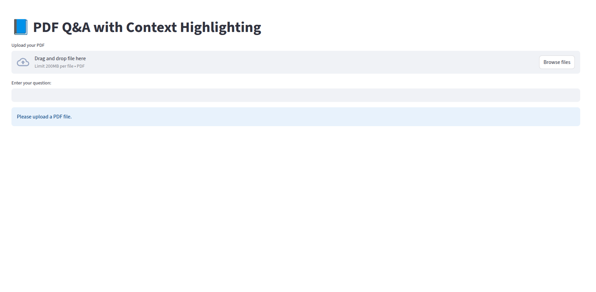

#  PDF Q&A with Context Highlighting

This project allows you to upload a PDF, ask questions about its content, and receive answers with context highlighting in the document.  
The application has two parts:  

- **Frontend** (Streamlit) – For uploading PDFs and interacting with the system  
- **Backend** (FastAPI) – For processing PDFs and handling queries  

---

##  Features
- Upload any PDF (up to 200MB)  
- Ask questions and get AI-generated answers  
- Highlights relevant sections in the PDF  
- Simple, clean UI  
- Example **Testing Notebook** provided in the `test` directory  

---

##  Setup Instructions

### 1️ Clone the Repository
```bash
git clone https://github.com/yourusername/your-repo.git
cd your-repo
```

### 2️ Create a Virtual Environment
```bash
python3 -m venv venv
```

### 3️ Activate the Virtual Environment

**Linux / MacOS:**
```bash
source venv/bin/activate
```

**Windows (PowerShell):**
```powershell
.env\Scripts\activate
```

### 4️ Install Dependencies
```bash
pip install -r requirements.txt
```

---

##  Running the Application

### **Frontend (Streamlit)**
1. Navigate to the `frontend` folder:
   ```bash
   cd frontend
   ```
2. Start the Streamlit app:
   ```bash
   streamlit run app.py
   ```

---

### **Backend (FastAPI)**
1. Open a **new terminal** (keep frontend running separately).
2. Navigate to the `backend` folder:
   ```bash
   cd backend
   ```
3. Start the backend server:
   ```bash
   uvicorn main:app --reload
   ```

---

##  Testing Notebook
A testing notebook is available in the **`test`** directory for checking the processing pipeline and seeing example results without running the UI.

---

##  Sample UI




---

##  Notes
- Run **frontend** and **backend** independently in separate terminals.  
- Make sure your virtual environment is activated before running either.  
- You can customize ports in `uvicorn` and Streamlit settings if needed.
